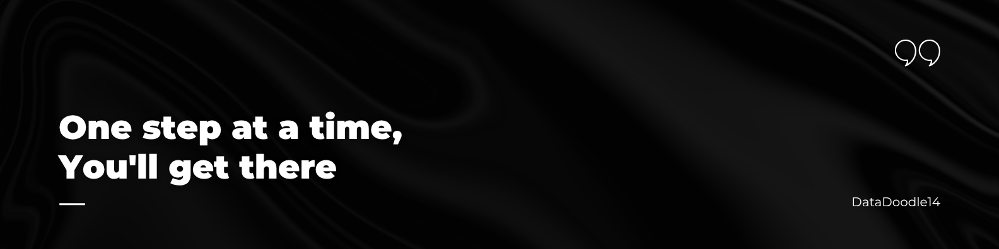

# Personal-Learning-Resources

## **Krutika Malli – Data Science & AI Learning Resources**

> A curated, **educational collection of open-source projects** in  
> **Machine Learning, Deep Learning, and Generative AI**  
> that I’m studying, analyzing, and extending for hands-on learning.  

---
### 🏷️ Topics Covered

##  About this Repository

This repository acts as my **personal learning hub** — organizing all the projects I’m learning from, in a transparent and ethical way.

Each subfolder represents a topic area and contains:
- Forked repos (with full author credits)

---

##  Repository Structure

| Folder | Description |
|--------|--------------|
| [ Machine Learning](machine_learning/README.md) | Supervised, unsupervised, and feature engineering projects |
| [ Deep Learning](deep_learning/README.md) | Neural architectures – CNNs, RNNs, LSTMs, Transformers |
| [ Generative AI](generative_ai/README.md) | LLMs, RAG pipelines, LangChain, and Agentic AI |
| [assets/](assets/) | Repository banner and visuals |

---

##  License and Credits

- This repository exists solely for educational, non-commercial, and self-improvement purposes.
- All projects inside this repository are **forked or adapted** from open-source repositories shared by amazing creators.  
- All linked or forked repositories **remain under their original licenses**  
- This `learning_resources` repository itself **contains no original code** and therefore does **not carry a separate license** at this time.
  
 *Full credit goes to the original authors.*

---

##  My Learning Goals

- Master end-to-end data workflows (cleaning → modeling → deployment)
- Strengthen ML, DL, Gen AI fundamentals.
- Explore Generative and Agentic AI systems

---

 *“Learning in public turns curiosity into credibility.”*  
— Krutika Malli
